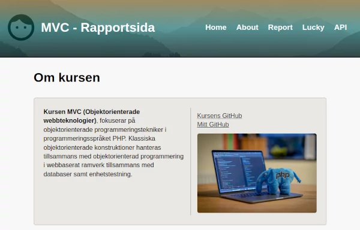

# MVC - Symfony/PHP

This is my course repo for exercises and reports in course MVC at BTH: https://dbwebb.se/mvc.




## Installation

**Prerequisites**<br>
You have installed PHP in the terminal.<br>
You have installed Composer, the PHP package manager.

Follow these steps to install the repo locally and start using it:

1. Clone repository (https or ssh):

#### https
```
git clone https://github.com/sofan/mvc.git
```
#### ssh
```
git clone git@github.com:sofan/mvc.git
```

2. Go to the created directory and install required dependencies

```
cd mvc
npm install
```

3. Install composer and PHP dependencies
```
composer install
```


## Run the webbsite
Build styles:

```
npm run build
```

Run the webbsite on [localhost:8888](http://localhost:8888/)
```
php -S localhost:8888 -t public
```

## Avaliable API endpoints

* /api/quote


## Scrutinizer
[](https://scrutinizer-ci.com/g/sofan/mvc/?branch=main)
[](https://scrutinizer-ci.com/g/sofan/mvc/?branch=main)
[](https://scrutinizer-ci.com/g/sofan/mvc/build-status/main)